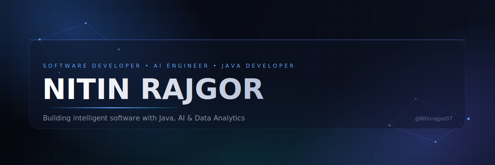

 

  

 

 

## Current Status

<table align="center" width="100%">
<tr>
<td width="25%" align="center" valign="top">
 

**💼 Role**

Interning @ Innovexis

 
</td>
<td width="25%" align="center" valign="top">
 

**🎓 Study**

MSc CS & IT · Sem 3
Jain University

 
</td>
<td width="25%" align="center" valign="top">
 

**🚧 Shipping**

Predictive Smart Toll
Pricing System

 
</td>
<td width="25%" align="center" valign="top">
 

**🎯 Open to**

Fresher Java Developer
/ SDE roles

 
</td>
</tr>
</table>

 

 

## About Me

I'm a Computer Science graduate student and software developer working at the point where **applied machine learning meets production-grade backend engineering**. My starting point is usually a research question — how do you price a toll dynamically based on traffic conditions, how does an agent learn to win at Ludo — and my finishing point is a working, deployable system with a real interface around it.

**Professional story.** I completed my BCA at Nav Gujarat College, Gandhinagar (Gujarat University), and I'm now in the third semester of an MSc in Computer Science & IT at Jain (Deemed-to-be) University, Bengaluru. Alongside my degree, I'm interning at Innovexis, and I split my project work between two threads that reinforce each other: **Java backend engineering** (Spring Boot, JDBC, OOP-driven system design) and **applied AI/data work** (scikit-learn, OpenCV, reinforcement learning). Two of my projects have been formalized into published research papers rather than staying as one-off builds.

**Career goals.** I'm looking for a fresher Java Developer or Software Development role where I can work on backend systems at production scale, ideally somewhere that also values the applied-ML side of my background rather than treating it as a separate track.

**Currently learning.** Deepening my Spring Boot and Spring Security fundamentals, sharpening SQL and system design basics, and continuing to formalize applied-ML side projects into complete, documented systems.

 

<table align="center" width="100%">
<tr>
<td align="center" width="25%">

**🎓 Degree**
 
MSc CS & IT
 
Jain University

</td>
<td align="center" width="25%">

**💼 Currently**
 
Interning
 
@ Innovexis

</td>
<td align="center" width="25%">

**📄 Published**
 
2 Research Papers
 
IRE Journals · IJEASR

</td>
<td align="center" width="25%">

**🎯 Target Role**
 
Fresher Java Developer
 
/ SDE

</td>
</tr>
</table>

 

 

## Tech Stack

<table align="center" width="100%">
<tr><td valign="top" width="50%">

**Languages**

  

**Frameworks**

</td><td valign="top" width="50%">

**Databases**

  

**Developer Tools**

  

**AI Tooling**

</td></tr>
</table>

 

 

## Featured Projects

<table align="center" width="100%">
<tr><td width="100%">

### 🚦 Predictive Smart Toll Pricing System
 

A dynamic toll-pricing engine built directly from my published research on predictive smart toll pricing. A Random Forest model (scikit-learn) estimates real-time congestion-adjusted pricing, served through a Flask backend with a dark-themed dashboard that visualizes pricing trends with Chart.js.

**Features**
- Random Forest model for predictive, traffic-aware toll pricing
- Flask REST backend serving live predictions
- Dark-theme dashboard with Chart.js visualizations
- Built directly on top of a peer-reviewed methodology, not a from-scratch guess

**Tech stack:** `Flask` `scikit-learn` `Random Forest` `Chart.js` `Python`

**Future scope:** real traffic-feed integration, multi-route pricing, and an admin panel for toll-authority configuration.

</td></tr>
<tr><td width="100%">

### 📈 Indian Stock Market Paper Trading Dashboard

A Streamlit-based paper trading platform for the Indian stock market, with sector-wise analysis tabs, a virtual balance system, and AI-generated market commentary powered by the Claude API.

**Features**
- Sector analysis tabs for Indian equities
- Virtual balance system for risk-free paper trading
- AI Analysis tab powered by the Claude API
- Zerodha-style P&L report

**Tech stack:** `Streamlit` `Python` `Claude API` `Pandas`

**Future scope:** live market data feed, multi-portfolio tracking, and historical performance backtesting.

</td></tr>
<tr><td width="100%">

### 🎓 Student Academic Management System

A full academic management platform with role-based login, color-coded attendance tracking, and an analytics dashboard visualizing student marks through Chart.js.

**Features**
- Role-based login (admin / faculty / student)
- Color-coded attendance indicators
- Chart.js-powered marks visualization
- Dedicated analytics dashboard with a fixed sidebar UI

**Tech stack:** `Flask` `MySQL` `Chart.js` `Java OOP concepts`

**Future scope:** exam scheduling module and parent-facing progress reports.

</td></tr>
<tr><td width="100%">

### 🧑‍💻 Face Recognition Attendance System

A desktop attendance system using the LBPH face-recognition algorithm, with a Tkinter interface and a SQLite backend for attendance records.

**Features**
- LBPH algorithm for face recognition via OpenCV
- Tkinter desktop interface
- SQLite-backed attendance logging
- Designed as a lightweight, dependency-light desktop deployment

**Tech stack:** `Python` `OpenCV` `SQLite` `Tkinter`

**Future scope:** liveness detection to prevent photo spoofing, and a web-based admin console.

</td></tr>
</table>

See <b>Open Source & Other Builds</b> below for the Aureum Luxury e-commerce platform and the Online Voting System.

 

 

## GitHub Analytics

<table align="center">
<tr>
<td></td>
<td></td>
</tr>
</table>

Snake animation renders after the GitHub Action in <code>setup-guide.md</code> runs once.

 

 

## Research Work

<table align="center" width="100%">
<tr><td>

**Predictive Smart Toll Pricing: A Machine Learning Approach**
Published in *IRE Journals*, Vol. 9, Issue 11, May 2026
DOI: [10.64388/IREV9I11-1717767](https://doi.org/10.64388/IREV9I11-1717767)
Proposes a Random Forest–based model for dynamic, congestion-aware toll pricing — later implemented as the Predictive Smart Toll Pricing System above.

</td></tr>
<tr><td>

**Deep Reinforcement Learning for Board Games**
Published in *IJEASR*
Compares DQN and PPO agents on Ludo gameplay, produced alongside a 35-page academic report and a full presentation deck as part of a group research project (TDPCL).

</td></tr>
</table>

 

 

## Open Source & Other Builds

<table align="center" width="100%">
<tr><td width="50%" valign="top">

**Aureum Luxury — E-commerce Platform**
Full-stack build: React 19 + TypeScript + Vite + Tailwind CSS on the frontend, Spring Boot + Spring Security + JWT on the backend. Includes JPA-modeled order management APIs and Java Streams–based advanced search.

`React` `TypeScript` `Spring Boot` `JWT` `JPA`

</td><td width="50%" valign="top">

**Online Voting System**
Election platform with admin and voter dashboards, live election countdown, and CSV export of results, with a Flask/MySQL backend option.

`HTML/JS` `Chart.js` `Flask` `MySQL`

</td></tr>
</table>

 

 

## Education

<table align="center" width="100%">
<tr><td width="70%">

**MSc Computer Science & IT** — Jain (Deemed-to-be) University, Bengaluru
Currently in Semester 3

</td><td width="30%" align="right">

</td></tr>
<tr><td width="70%">

**BCA** — Nav Gujarat College, Gandhinagar (Gujarat University)

</td><td width="30%" align="right">

</td></tr>
</table>

 

## Certifications

  

 

## Contact

 

 

*"Research gives you the idea. Engineering makes it real."*

 

  

© 2026 Nitin Rajgor

